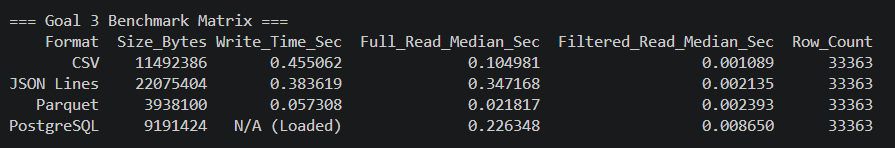

# DSS150P Laboratory 3 Starter Repository

This repository supports Module 2: Pipeline Construction, Storage, and Orchestration.
It is intentionally incomplete. Students must implement the marked TODOs and document their decisions.

## Main progression
- Goal 1: reproducible environment, modularization, Git, Docker, configuration
- Goal 2: raw -> staging -> curated transformations; audit/error handling; rerun-safe loading
- Goal 3: CSV/JSON/Parquet/PostgreSQL comparison; partitioning; selected-partition load
- Goal 4: Apache Airflow DAG for extract -> transform -> load -> validate

Start with `DSS150P_Laboratory_Activity_3.pdf`.

## Recommended commands
```bash
cp .env.example .env
python -m venv .venv
# activate .venv then:
pip install -r requirements.txt
python -m src.cli validate-env
```
The provided `.env.example` uses `POSTGRES_HOST=localhost` for host-side commands. Docker Compose overrides the application containers to use the service hostname `postgres`.

Docker/PostgreSQL:
```bash
docker compose up -d postgres
docker compose run --rm pipeline python -m src.cli validate-env
```

Airflow in Goal 4:
```bash
docker compose -f docker-compose.yml -f docker-compose.airflow.yml up airflow-init
docker compose -f docker-compose.yml -f docker-compose.airflow.yml up -d airflow-webserver airflow-scheduler
```
Airflow UI: http://localhost:8080 (training credentials: admin/admin; change if reused outside the lab).


## Additonal findings: 

Task B - Inspection came out complete: All SRC components are where they need to be and function how they are supposed to be.
Task D - With a bit of back tracking, I found out that forgetting to remove the semi-colon next to the POSTGRE_PASSWORD had a resulting effect that gave me an error on this task. Requiring me to back-track to task C and make those necessary changes.Within the three fields "config.py, airflow.yml, and docker compose.yml",specifically in the Password section.

``Inspection of PostgreSQL Initilization:``
 Name   |       Owner       
---------+-------------------
 audit   | dss150p
 curated | dss150p
 public  | pg_database_owner
 staging | dss150p
(4 rows) 

 Schema  |       Name        | Type  |  Owner  
---------+-------------------+-------+---------
 curated | sales_order_lines | table | dss150p
(1 row)

Task E 
- Environment output = (Retrieved using:python -m src.cli validate-env)
PROJECT_ROOT= C:\repovscode\dss150p-lab03-starter-main
DB host/database= localhost dss150p
Configured source= data/source  
- Docker/Compose status = (healthy)
- Git log = Output:
b762b31 (HEAD -> goal1-reproducible-environment, origin/main, main) Small changes to Task C, noted in the READme and Finished Task D
83772aa Forgot to include the Case for inspection in task B status in readme
6abab64 TASK C succesfully removed all fields revealing password
1edd47d Created .env with gitignore, including .env.example
21554ef Testing commit
- Explanation: I personally believe that configuration should be kept seperate from code because it contains sensitive information that need to be kept secret and private, hence why we have exclusions like the ones placed in gitignore.

``Goal 1 (7.6) Acceptance tests``
- Fresh virtual environment installs from requirements.txt. = Works as intended with no error, given that I am currently using python (3.12.10). However, it was previously stated that (3.14) did give me problems due to early build issues.
- python -m src.cli validate-env succeeds locally = works and prints PROJECT_ROOT, DB host/database, and Configured source.
- docker compose run --rm pipeline python -m src.cli validate-env succeeds. = Responds successfully with output 
  [+] run 1/1
 ✔ Container dss150p-postgres Running                                                0.0s
Container dss150p-postgres Waiting 
Container dss150p-postgres Healthy 
Container dss150p-lab03-starter-main-pipeline-run-19a5fb6e3644 Creating 
Container dss150p-lab03-starter-main-pipeline-run-19a5fb6e3644 Created 
PROJECT_ROOT= /app
DB host/database= postgres dss150p
Configured source= data/source
- PostgreSQL starts healthy and contains the expected schemas. = Starts healthy and contains the schemas for curated and non-curated.
- .env is not tracked by Git. = Confirmed 
- Code is divided into modules with clear responsibilities = Accomplished

## Goal 2 
- TASK A (8.2) = Syntax construction was able to produce the required snapshots, with respect to 8.1 requirements. Running the whole line within the command line "python -c "from src.extract.files import extract_sources; print(extract_sources('test_001'))" To confirm it returning the needed snapshots and creating the folder in data. 
``Note for 8.2 - The bulk of the syntax construction was gotten from built-in intellicence, while the refinement was done with the help of AI (Gemini). To help ensure functionality and accuracy of paths of the code.``

- Task B (8.3) = There were some initial problems that were presented upon initially running **"python -c "from src.extract.files import extract_sources; from src.transform.staging import stage_all; extract_sources('test_001'); print(stage_all('test_001'))"**. This was carefully inspected and troubleshooted using ``Gemini AI``. There was an initial debugging stage, first running a syntax that displays the column names of each file (customer.csv,orders.csv,products.json). It was revealed that "name" was not found in the the original customers.csv. Another was order_date was looked for instead of order_timestamp. Lastly, price in products.parquet was attempted to be located when it should have been unit_price. All-in-all, the bug was more on naming issues for specific columns. The second run fixed all these issues and successfully accomplished the task.

- Task C (8.4) = This was more carefully done, after learning from the previous tasks mistakes. The code was first structured into a functioning/workable state, where I asked assistance from ``"Gemini"`` AI to help refine and possible troubleshoot the code, if any issues or inefficiencies lie. It came back as positive, not reporting any issues, suggesting that the code was alright to be run via vscode terminal using "python -c "from src.extract.files import extract_sources; from src.transform.staging import stage_all; from src.transform.curated import curate_all; extract_sources('test_001'); stage_all('test_001'); print(curate_all('test_001'))". 

- Task D (8.5) = 
## Pipeline Execution and Orchestration

The pipeline is managed through a central command-line interface entrypoint located at `src/cli.py`. This script provides a modular execution interface that allows running individual pipeline phases independently or orchestrating the complete end-to-end flow in sequence. Every execution generates a unique, timestamped `run_id` to ensure isolated, reproducible runs and maintain audit lineage across all data layers.

### Purpose that it serves

- **Environment Validation (`validate-env`):** Inspects the active environment configuration, printing the project root path, database target details, and configured source data directory. Run this command first to verify settings before executing data operations.
- **Raw Extraction (`extract`):** Reads source datasets from the configured input directory and creates an immutable raw snapshot partitioned under `data/raw/run_id=<run_id>/`.
- **Data Transformation (`transform`):** Runs both staging and curated processing layers in sequence. The staging layer cleans fields, enforces schemas, deduplicates records, and routes invalid rows to quarantine. The curated layer joins staged entities, computes financial metrics (`gross_amount`, `discount_amount`, `net_amount`), generates record hashes, and flags orphan records.
- **End-to-End Execution (`run-all`):** Orchestrates the full ETL workflow (`extract` followed by `transform`), executing the pipeline end-to-end within a single execution context.

### Execution Examples
Through this we will be able to proceed with the following commands needed in (8.6)
- python -m src.cli run-all
- python -m src.cli load
- python -m src.cli load

- Task (8.6) E = This specific was done with a lot of trouble shooting and will be discussed in the form of bullets points, since essay form would be too long. 
- Database access configuration using .env and config.py, ensuring that python can connect to the PostgreSQL container.
- Constructed the UPSERT load, with the base code (upsert_curated) used to insert new rows and update the existing ones using order_id as the key.
- Handled the column constraints by adding default values for required columns (status, source_updated_at,) to meet database constraints and prevent errors. 
- Created load_partition() to filter data by year/month and log execution details in an audit table.
- Updated cli.py to run load and load partition
- Added another py file located in common ``validation.py`` to verify necessary fields row counts and financial formulas.
- Idempotency tests = Running the pipeline came out after the second attempt and gave 0 duplicate records, keeping a total of 33,363 total rows matching distinct orders.

## Goal 2 acceptance tests (8.7) -> An easier summary that was constructed with the use of LLM Gemini.
``Raw snapshots are run-specific and source files remain unchanged.``
- This was verified via the snapshot.py saves raw extracts under data/raw/run_id wihtout overwriting base source files.
``Duplicate business keys are resolved deterministically using latest updated_at.``
- Verified during deduplication in transformation where duplicate order records select the row with the lastest timestamp.
``Invalid technical records and orphan references are quarantined with reasons.``
- Verified by checks that would route the malformed rows or missing foreign keys inot a "quarantine" folder that shows the different error tags.
``Curated amounts are calculated and audit columns are populated``
- Verified in transformation where gross_amount, discount_amount, and net_amount are computed alongside metadata fields(pipeline_run_id, processed_at_utc, record_hash).
``Validation detects duplicate/null business keys and invalid amounts/statuses.``
- This was answered using the command (python-m src.cli validate) which runs assertions against missing keys, negative/mismatched financial amounts, and invalid status values.
``Repeated load does not create duplicate order_id values.``
- Using the command given, **SELECT COUNT(*) total, COUNT(DISTINCT order_id) distinct_orders**, it returned 33,363 total rows matching distinct orders, effectively yielding 0 duplicates in order_id values.

- Task (9.1) A and Task (9.2) B
- The curated dataset ``(curated.sales_order_lines)`` contained 33,363 records that was made into four storage formats (Parquet,PostgreSQL,CSV,JSON)

- In summary, Parquet was the most efficient due to columnar storage and block compression. While JSON was the the least efficient among all of them due to reapting key and column name strings on every record object.
`` Ran using command python -m src.cli benchmark``
- Task 9.3 C
- Partionining enables query engines and data tools (such as PyArrow or Spark) to bypass scanning irrelevant year/month subdirectories during during date-range filters, drastically reducing I/O footprints for targeted analytical queries. The data was placed in the data/partitioned location in the repo. 
- Task 9.4 D 
- Added validate_partition_pruning in src/benchmark/storage.py
- Added a validation function that reads the hive-partitioned directory(data/partitioned/)using PyArrow filters (orders_year == 2024 and order_month == 1) and asserts that row counts are correctly reduced.
- Fixed engine configuration and database schema in src/load/postgres.py
- resolved Database error (psycopg2.errors.UndefinedColumn) by dropping the existing audit.parititon_loads table and aligning column names (year,month) across SQL creation and insertion queries.
- Wired load-partition and validate_partition_pruning execution into the CLI benchmark dispatcher.
- This allows for us to use the command line executions:
**python -m src.cli benchmark** and **python -m src.cli load-partition --year 2026 --month 1**
## GOAL 3 analysis questions
- Which file format was smallest on your machine, and what encoding/compression characteristics help explain the result?
= Smallest on my machine was reported as the Parquet (3938100 bytes). The characteristics it possesses is a columnar storage layour, which allows values of the same data type to be stored sequentially. This enables high-ratio dictionary encoding, run-length encoding (RLE), and Snappy block compression, outperforming the other files like CSV and JSON.
- Which representation was fastest for full dataset reads? Does that imply it is best for every worklaod?
= Fastest format goes to the Parquet, containing a median latency of around 0.22 seconds. I do not think it implies that Parquet is the best for every workload. It might be an ideal answer for OLAP, but the opposite can be said for OLTP's.
- How did filtered retrieval differ between Parquet and PostgreSQL? What additional PostgreSQL design (such as index) could change the result?
= Parquet filtering evaluated in-memory/pushdown predicares (status == 'Delivered) in 0.002s, whereas PostgreSQL executed full table scans via SQLAlchemy SQL queries in 0.009s. Added a hash index on the status column (CREATE INDEX idx_status ON curated.sales_order_lines(status);) or creating table partitions would eliminate sequential scans in PostgreSQL, allowing for fast index lookups and competitive retrieval speeds.
- Why is JSON Lines generally more pipeline-friendly than one giant JSON array for append/stream-oriented processing?
= JSON lines stores each JSON object on its own newline delimtier. This allows producers to continously append records without parsing or re-writing opening/closing array brackets ([and]). Consumers can stream and prcess the file record-by-record without loading the entire payload into RAM.
- What happens if a partition key has extremely high cardinality or poor query locality?
= High cardinality causes the creation of lots of tiny subdirectories and files. This significantly inflates file system overhead, degrades metadata traversal performance.