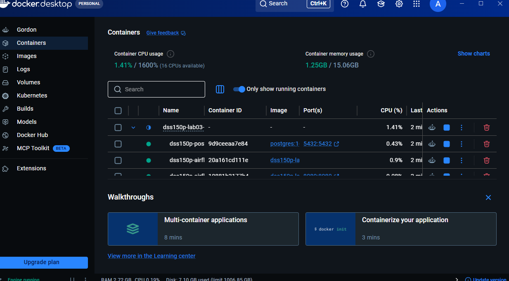

# Run Evidence

## Week 4
- Python version: 3.12.10
- Git status/log evidence: Git log = Output:
b762b31 (HEAD -> goal1-reproducible-environment, origin/main, main) Small changes to Task C, noted in the READme and Finished Task D
83772aa Forgot to include the Case for inspection in task B status in readme
6abab64 TASK C succesfully removed all fields revealing password
1edd47d Created .env with gitignore, including .env.example
21554ef Testing commit
- Docker image/container evidence:
- External configuration evidence: Non-secret defaults (paths, layer names) live in config/settings.yml. Secrets and environment-specific values (DB password, host) are stored in .env, which is excluded from Git via .gitignore

## Week 5
- Raw row counts: customers=3,003  orders=50,005  products=601
- Staging row counts: customers=3,000  orders=33,426  products=599
- Curated row counts: 33,363
- Quarantine row counts: 16,575
- First load affected rows: invalid_orders=16,575 (invalid quantity/status)  orphan_customer=1  orphan_product=62  invalid_products=1 Total quarantined: 16,639
- Second rerun affected rows / evidence of idempotency: First load affected rows: 33,363 rows inserted into curated.sales_order_lines
Second rerun affected rows / evidence of idempotency: 0 new rows inserted. SELECT COUNT(*) total, COUNT(DISTINCT order_id) distinct_orders FROM curated.sales_order_lines; returned total=33,363 and distinct_orders=33,363 no duplicates created on rerun.

## Week 6
- Benchmark table attached: yes (data/benchmarks/benchmark_curated.csv — 33,363 rows, 5 read iterations each)
Format	Size (bytes)	Write Time (s)	Full Read Median (s)	Filtered Read Median (s)
CSV	11,492,386	0.455062	0.104981	0.001089
JSON Lines	22,075,404	0.383619	0.347168	0.002135
Parquet	3,938,100	0.057308	0.021817	0.002393
PostgreSQL	9,191,424	N/A (Loaded)	0.226348	0.008650

- Partition selected: order_year=2026, order_month=1
- Partition row count: 1,684
- PostgreSQL verification query:   SELECT COUNT(*) total, COUNT(DISTINCT order_id) distinct_orders
  FROM curated.sales_order_lines;
  Result: total=33363, distinct_orders=33363

## Week 7
- DAG ID: dss150p_sales_pipeline
- Schedule: 0 2 * * *    
- Parameters used: run_mode=full (full pipeline run); run_mode=partition, year=2026, month=1 (parameterized partition run)
- Successful run ID: 
  Full run started 2026-09-21 12:39:20 UTC — all 4 tasks (extract, transform, load, validate) completed with status success. Pipeline run ID propagated: run_20260921T153708Z_bab22726. Second full run at 2026-09-21 13:14:21 UTC also succeeded (total success runs = 2 before failure test).
- Deliberate failure run ID:
  Deliberate failure run ID: Run started 2026-09-21 14:08:16 UTC — triggered by renaming data/source/orders.csv into orders_backup.csv before DAG trigger. The extract task failed after exhausting 2 retries (Try Number 3, duration 00:00:01). Downstream tasks (transform, load, validate) were marked upstream_failed and did not execute.
- Retry/failure-handling evidence: DAG Runs Summary showed Total failed=1 at 14:10:22 UTC.
- Final recovery run ID: orders_backup.csv renamed back to orders.csv. New run triggered at 2026-09-21 14:19:24 UTC — all 4 tasks succeeded. Total success runs=4, failed=0. No manual DB cleanup required; UPSERT logic ensured zero duplicate rows.
